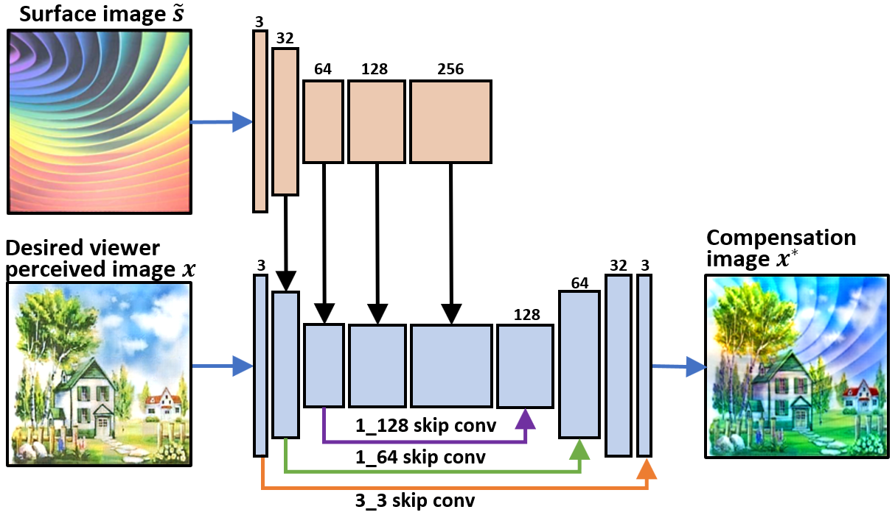
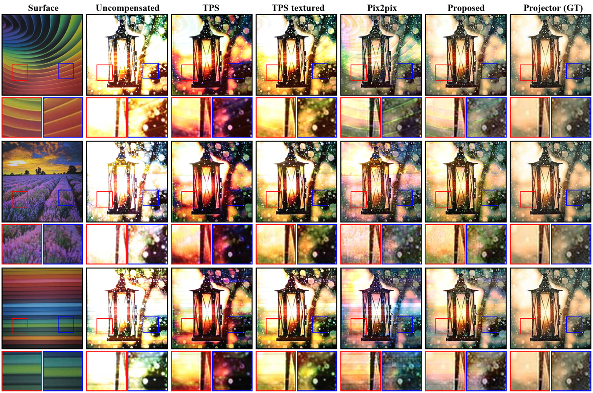
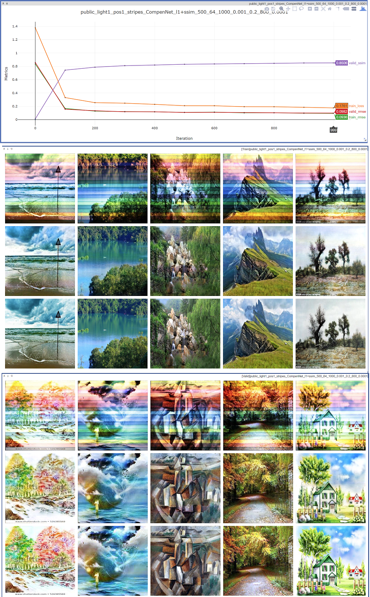
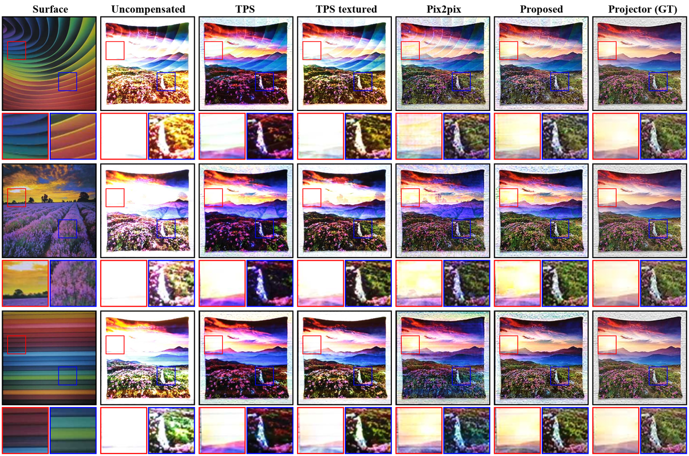
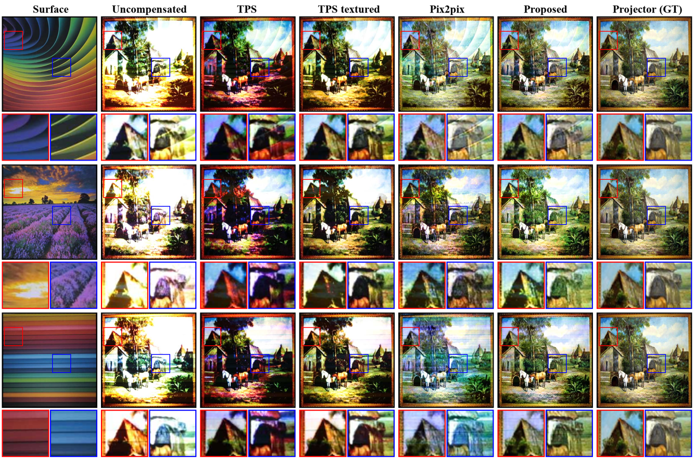

  

End-to-end Projector Photometric Compensation (to appear in CVPR'19)
  
===

## Introduction
PyTorch implementation of [CompenNet][1].

Highlights:
* For the first time, we formulate the compensation problem as an end-to-end learning problem and propose a convolutional neural network, named **CompenNet**, to implicitly learn the complex compensation function.
* A novel evaluation benchmark, which is independent of system setup and thus quantitatively verifiable. Such benchmark is not previously available.
* Our method is evaluated carefully on the benchmark, and the results show that our end-to-end learning solution outperforms state-of-the-arts both qualitatively and quantitatively by a significant margin.

For more info please refer to our [CVPR'19 paper][1] and [supplementary material][2].

## Prerequisites
* PyTorch compatible GPU
* Python 3
* PyTorch >= 0.4.0
* opencv-python 3.4.4
* visdom (for visualization)

## Usage
### 

1. Clone this repo:
   
        git clone https://github.com/BingyaoHuang/CompenNet
        cd CompenNet

2. Install required packages by typing
   
        pip install -r requirements.txt
    

3. Download CompenNet [benchmark dataset][3] and extract to [`CompenNet/data`](data)

        
4. Start **visdom** by typing

        visdom

5. Once visdom is successfully started, visit [`http://localhost:8097`](http://localhost:8097)
6. Open [`main.py`](src/python/main.py) and set which GPUs to use. An example is shown below, we use GPU 0, 2 and 3 to train the model.
   
        os.environ['CUDA_VISIBLE_DEVICES'] = '0, 2, 3'
        device_ids = [0, 1, 2]

7. Run [`main.py`](src/python/main.py) to start training and testing

        cd src/python
        python main.py
8. The training and validation results are updated in the browser during training. An example is shown below, where the 1st figure shows the training and validation loss, rmse and ssim curves. The 2nd and 3rd montage figures are the training and validation pictures, respectively. In each montage figure, the **1st rows are the camera captured uncompensated images, the 2nd rows are CompenNet predicted projector input images and the 3rd rows are ground truth of projector input image**. 
   

----
## Apply CompenNet to your own setup

1. For a planar textured projection surface, adjust the camera-projector such that the brightest projected input image (plain white) slightly overexposes the camera captured image. Similarly, the darkest projected input image (plain black) slightly underexposes the camera captured image. This allows the projector dynamic range to cover the full camera dynamic range.
2. Project and capture the images in `CompenNet/data/train` and `CompenNet/data/test`.
3. Project and capture a surface image `CompenNet/data/ref/img_gray`.
4. Project and capture a [checkerboard image](doc/checkerboard.png).
5. Estimate the homography `H` between camera and projector image, then warp the camera captured images `train`, `test` and `img_gray` to projector's view using `H`. 
6. Finally save the warped images to `CompenNet/data/light[n]/pos[m]/warp/[surface]/train`,  `CompenNet/data/light[n]/pos[m]/[surface]/warp/test` and  `CompenNet/data/light[n]/pos[m]/[surface]/warp/ref`, respectively, where `[n]` and `[m]` are lighting setup index and position setup index, `[surface]` is projection surface's name.
   
Note `ref/img_0001.png` to `ref/img_0125.png` are plain color training images used by TPS-based method, you don't need to use these images to train CompenNet.

----
## Implement your own CompenNet model
1. Create a new class e.g., `NewModel` in [`CompenNetModel.py`](src/python/CompenNetModel.py).
2. Add the new class name string to `model_list`, e.g., `model_list = ['NewModel', 'CompenNet']` in [`main.py`](src/python/main.py).
3. Run `main.py`.
4. The quantitative comparison results between `NewModel` and `CompenNet`  will be saved to `log/%Y-%m-%d_%H_%M_%S.txt` and an example is shown below, where prefix `uncmp_` means the similarity between uncompensated camera-captured images and ground truth of projector input images. Prefix `valid_` means the similarity between CompenNet predicted projector input images and ground truth of projector input images. Refer to our [CVPR'19 paper][1] Fig. 3 for more details.

### 

        data_name              model_name   loss_function   num_train  batch_size  max_iters  uncmp_psnr  uncmp_rmse  uncmp_ssim  valid_psnr  valid_rmse  valid_ssim     
        light2/pos1/curves     NewModel     l1+ssim         500        64          1000       14.3722     0.3311      0.5693      23.2068     0.1197      0.7974   
        light2/pos1/curves     CompenNet    l1+ssim         500        64          1000       14.3722     0.3311      0.5693      23.1205     0.1209      0.7943   
        light2/pos1/squares    NewModel     l1+ssim         500        64          1000       10.7664     0.5015      0.5137      20.1589     0.1701      0.7032  
        light2/pos1/squares    CompenNet    l1+ssim         500        64          1000       10.7664     0.5015      0.5137      20.1673     0.1699      0.7045   
        light1/pos1/stripes    NewModel     l1+ssim         500        64          1000       15.1421     0.3030      0.6264      24.9872     0.0975      0.8519 
        light1/pos1/stripes    CompenNet    l1+ssim         500        64          1000       15.1421     0.3030      0.6264      24.9245     0.0983      0.8508     
        light2/pos2/lavender   NewModel     l1+ssim         500        64          1000       13.1573     0.3808      0.5665      22.2718     0.1333      0.7723   
        light2/pos2/lavender   CompenNet    l1+ssim         500        64          1000       13.1573     0.3808      0.5665      22.1861     0.1347      0.7693 

        
## More qualitative comparison results

    
## Citation
Please cite these papers in your publications if it helps your research:

    @inproceedings{huang2019compennet,
        author = "Huang, Bingyao and Ling, Haibin",
        title = "End-to-end Projector Photometric Compensation",
        year = "2019",
        booktitle = "IEEE Computer Society Conference on Computer Vision and Pattern Recognition (To appear)"
    }

## Acknowledgments
The PyTorch implementation of SSIM loss is modified from [Po-Hsun-Su/pytorch-ssim](https://github.com/Po-Hsun-Su/pytorch-ssim).

## License
This software is freely available for non-profit non-commercial use, and may be redistributed under the conditions in [license](LICENSE).

[1]: https://arxiv.org/pdf/1904.04335
[2]: http://www.dabi.temple.edu/~hbling/publication/CompenNet_sup.pdf
[3]: http://bit.ly/2G5iTfY
[4]: https://www.mathworks.com/help/vision/ref/detectcheckerboardpoints.html
[5]: https://github.com/BingyaoHuang/single-shot-pro-cam-calib/tree/ismar18
[6]: https://youtu.be/fnrVDOhcu7I
[7]: http://www.vision.caltech.edu/bouguetj/calib_doc/htmls/calib_example/index.html

